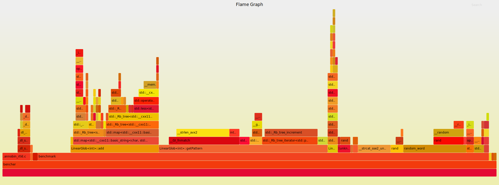

# LinearGlob
A linear time c++ map wrapper that allows for fetching all keys associated with globs.

For example, given a map with the associations:

```
dog -> 1
fog -> 2
cat -> 3
```
Calling `myGlob.getPattern("*og");` would yield a `std::vector` containing `1, 2`.

This is not intended to be fast at all & exists mostly as an implementation to use to benchmark against para-glob as I work on that. More to come on paraglob...

## This implementation flame graph for add and get operations

